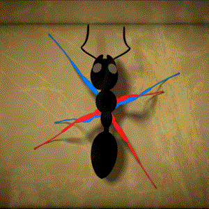
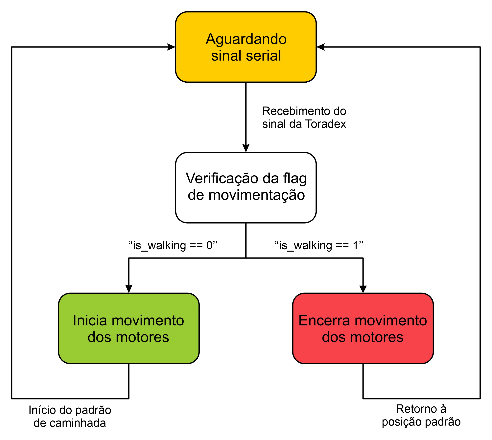

# BugsBots-Aprimoramento-do-Formiga

  Projeto de SAA0356 - Sistemas Embarcados para Veículos Aéreos 2022.2
  
  Ministrante: Prof. Dr. Glauco Augusto de Paula Caurin
  
  Departamento de Engenharia Aeronáutica

## Alunos:
* **Caique Augusto Cerqueira Dioceser**  *N° USP: 11232264*
* **Cristina Luciana Rodrigues Saraiva Leão** *N° USP: 10716696* 
* **João Vítor Viana Falcão** *N° USP: 11232413* 
* **Laura Queiroz Soares** *N° USP: 11372625* 
* **Natthan Wictor de Camargo** *N° USP: 11352702* 

# Introdução
Estima-se que existam cerca de 18.000 espécies de formigas no mundo, ao final deste será possível dizer que existe uma espécie nova de formiga, a robótica. Por meio de softwares e hardwares computacionais e mecatrônicos foi desenvolvido um robô de seis pernas capaz de se locomover de forma autônoma. A razão para o desenvolvimento de um robô hexápode é sua facilidade de locomoção em terrenos irregulares, se mantendo mais estável do que em comparação com dispositivos de aplicação parecida compostos por rodas.

## Objetivo
Desenvolver o acionamento e a coordenação de múltiplos servo atuadores de aeromodelismo para implementação de um padrão de caminhada para um robô de seis pernas.

## Materiais e Métodos
Utilizou-se um sistema de hardware, o qual consiste em uma placa Toradex Colibri VF61 embarcada na Viola Carrier Board e dois microcontroladores MBED LPC1768 pela proximidade dos membros do grupo com o laboratório Liepo do Professor Dr. Daniel Varela Magalhães, logo conseguimos esses itens emprestados para o projeto de implementação de caminhada para o robô Formiga. Além disso, foi necessário uma Carrier Board Iris, um cartão micro SD e um cabo de adaptador serial RS232 para USB-A para instalação do sistema operacional na Toradex Colibri VF61, o qual utilizamos o Linux (Ubuntu no host e Angstrom na Colibri). Já as linguagens de programação foram Python (VF61) e C++ (MBED). Por fim, foram usados 2 servos motores em cada perna, totalizando 12 em todo no robô.

<p align="center">


</p>

<p align="center">


</p>

Para a implementação, foram utilizadas saídas PWM para informar as posições dos servos e a comunicação dos microcontroladores (MBEDs) com a Toradex foi feita por meio da comunicação serial. A principal vantagem da comunicação serial é a diminuição dos gastos para que o sistema continue funcionando. Além disso, a transmissão de dados acontece de forma simplificada, onde é utilizado apenas um canal de comunicação.

# Desenvolvimento

## Instalação do Linux Angstrom na Colibri VF61
Utilizamos a VF61 como placa de desenvolvimento juntamente com a Carrier Board Viola já que era a proposta da disciplina, porém utilizamos a Carrier Board Iris para instalação do Linux Angstrom, uma vez que ela possui pinos de conexão UART que possibilitam um melhor acompanhamento do processo de reinstalação de SO. No entanto, a placa emprestada estava com Windows CE instalado, logo tivemos que seguir o tutorial de "Flashing Embedded Linux to Vybrid Modules" presente no Toradex Develop Center.

Em primeiro lugar, deve-se instalar algumas aplicações e bibliotecas necessárias para o procedimento.

```
> sudo apt-get update
> sudo apt-get install dosfstools e2fsprogs gawk mtools parted
> sudo apt-get install zlib1g liblzo2-2 libuuid1 libusb-1.0-0
```

Em seguida, baixa-se a imagem de instalação do Linux Angstrom (pasta deve ser extraída com root permissions). Executa-se o programa ./update.sh com o ponto de montagem do cartão Micro SD como argumento de destino, lembrando que o ponto de montagem do cartão micro SD pode ser encontrado com o comando "lsblk" executado direto pelo terminal do host.

```
> ./update.sh -o /media/KERNEL/
```

Após esse passo, o cartão micro SD está carregado com o U-Boot, necessário para a instalação do SO Angstrom na placa Colibri. Como a placa utilizada no projeto possuía Windows CE anteriormente, seguimos a parte do tutorial relacionada com "Flashing image using Eboot (WinCE)", executando os seguintes comandos após entrar no prompt de comando.

```
> flashloader colibri_vf/u-boot-nand.imx
> reboot
```

Após o reboot, é necessário rodar os procedimentos a seguir para a instalação do novo sistema operacional na VF61.

```
> Colibri VFxx # nand erase.part ubi
...
> Colibri VFxx # run setupdate
...
> Colibri VFxx # run update
```

Com esse processo, foi possível instalar com sucesso o Linux Angstrom na placa Colibri VF61, o que possibilitou o uso da comunicação ssh, permitindo a continuação do projeto.

## Conexão SSH
O SSH pode ser usado para transferência de arquivos criptografados entre seu host e o módulo. Utilizamos o roteiro da Aula 3 (Build, Compile, Link) disponibilizado pelo professor como base para realizar a conexão com a placa Toradex.

Sabendo o endereço de IP do módulo utilizado (192.168.1.103), podemos realizar a conexão por meio das seguintes etapas:

Enviar o código para Toradex:

```
> scp walk.py root@192.168.1.103/home/root
```

 Em outro terminal, executar o código dentro da Toradex:

```
> ssh root@192.168.1.103
> python walk.py
```

## Comunicação Serial Toradex - Mbed
Para a comunicação da Toradex com os microcontroladores MBEDs, optamos pela comunicação serial por ser mais simples e também devido à inexperiência dos integrantes do grupo com o protocolo CAN. Por isso, a placa Viola é conectada às 2 MBEDs por meio de portas USB, de modo que ela envia uma mensagem de caminhada às duas portas fazendo com que os dois controladores recebam e interpretem o sinal (traduzam a mensagem), executando o movimento desejado. Além disso, vale mencionar que a comunicação serial pela Colibri VF61 foi possível por meio da instalação da biblioteca pyserial, permitindo o envio de informações para as MBEDs por meio da execução de um código em python de conexão serial.

"Falar sobre o passo a passo da intalção da biblioteca"

Dessa forma, implementamos um código simples em python que acessa as portas seriais USB da Colibri VF61 e envia uma mensagem para cada mbed.

```
ser1 = serial.Serial("/dev/serial/by-id/usb-mbed_Microcontroller_101000000000000000000002F7F0C7A2-if01")
ser2 = serial.Serial("/dev/serial/by-id/usb-mbed_Microcontroller_101000000000000000000002F7F1EA94-if01")

ser1.write(1)
ser2.write(1)
```

Já na mbed, especificamos a porta serial utilizada (USB Serial), por meio da identificação no código e dentro do loop da função principal era verificado a disponibilidade de leitura dessa porta que ao receber uma mensagem acionava o restante do código.

```
// Serial port
Serial  toradex(USBTX, USBRX);  // tx, rx

...

     while(1) {

          if (toradex.readable()) {

          ....

          }
```

## Controle dos Motores e Padrão de Caminhada
Para este projeto foram utilizadas duas placas MBED LPC1768, sendo que para cada pata são necessários dois motores para lidar com o movimento horizontal e vertical, totalizando 12 servomotores no projeto. Desta forma, cada MBED fica responsável pelo controle de 6 motores, ou seja, 3 pernas, já que cada placa possui 6 pinos de controle PWM.

<p align="center">

</p>

A lógica de caminhada consiste no movimento de 3 patas por vez, sendo elas alternadas (2 nas pontas de um lado e 1 no meio do outro lado), de forma que as outras 3 permaneçam no chão durante esse tempo. Esse padrão de caminhada foi adotado devido a semelhança com a movimentação de insetos que também possuém 6 patas e por permitir uma maior estabilidade do robô.

<p align="center">

</p>

Uma vez que esse movimento é intercalado, cada MBED está conectado a um conjunto de pernas (6 motores) que se movimentam ao mesmo tempo e o controle dos motores é feito através do códigos que foram escritos diretamente nos microcontroladores. Para essa implementação, foi utilizado a própria interface de desenvolvimento da MBED, o mbed Compiler, que pode ser acesado diretamente do sites deles, o que facilita trabalhar com as bibliotecas necessásrias para o desenvolvimento do projeto. Desta forma, basta declarar as portas nas quais os moteres estão conectados, o período e o tamanho do pulso PWM (correspondente ao angulo desejado)para realizar o movimento.

```
// PWM pins
PwmOut  coxa1(p21);
PwmOut  perna1(p22);

...

coxa1.period(0.020);
perna1.period(0.020);

...

coxa1.pulsewidth(0.0013);
perna1.pulsewidth(0.0017);
```

Dessa forma, a lógica estabelecida verifica a possibilidade de leitura da porta Serial e ao rebecer uma mensagem, verifica em qual estado o robô se encontra, andando ou estático, e alterna entre esses estados a cada vez que tem uma chamada na porta Serial.

<p align="center">

</p>

# Resultados

Inicialmente, foram realizados testes com o robô movendo as pernas em cima de um suporte para evitar a possibilidade do robô quebrar ou ser danificado durante a execução do movimento por possiveis erros na elaboração do sistema embarcado.

<p align="center">
<https://user-images.githubusercontent.com/119769311/207974322-b9b8b9bb-30bd-4893-a7dd-93c34144b0fc.mp4 >
</p>
Posteriormente, quando os resultados no suporte se mostraram satisfatórios, colocamos ele no chão e o teste definitivo foi feito (sem a comunicação serial com a Toradex, apenas para verificação do funcionamento do padrão de caminhada).

<p align="center">
<https://user-images.githubusercontent.com/119769311/207929898-81dae449-8cf5-42a6-8e74-0f024d8560f7.mp4 >
</p>

# Conclusão
Apesar do projeto ter sido bem sucedido, vale ressaltar que a comunicação serial não fazia parte da ideia inicial, uma vez que, ao se trabalhar com MBEDs, é melhor usar o protocolo CAN para a comunicação, pois permite que outros dispositivos sejam conectados na mesma rede. Contudo, conforme apontado anteriormente, não foi possível a implementação desse tipo de comunicação, devido a falta de experiência da equipe com um protocolo tão robusto juntamente com o tempo limitado para tal. Portanto, optou-se pela comunicação serial, por sua simplicidade, permitindo a realização do projeto proposto e dando a oportunidade de trabalhar com sistemas embarcados, logo, pode-se afirmar que o objetivo acadêmico da disciplina foi alcançado.
