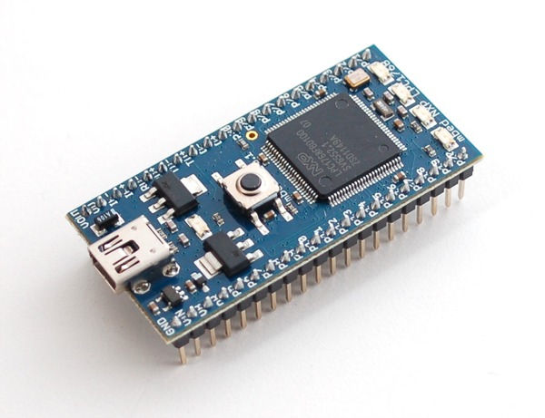

# BugsBots-Aprimoramento-do-Formiga

  Projeto de SAA0356 - Sistemas Embarcados para Veículos Aéreos 2022.2
  
  Ministrante: Prof. Dr. Glauco Augusto de Paula Caurin
  
  Departamento de Engenharia Aeronáutica
  

## Alunos:
* **Caique Augusto Cerqueira Dioceser**  *N° USP: 11232264*
* **Cristina Luciana Rodrigues Saraiva Leão** *N° USP: 10716696* 
* **João Vítor Viana Falcão** *N° USP: 11232413* 
* **Laura Queiroz Soares** *N° USP: 11372625* 
* **Natthan Wictor de Camargo** *N° USP: 11352702* 

# Introdução
Estima-se que existam cerca de 18.000 espécies de formigas no mundo, ao final deste será possível dizer que existe uma espécie nova de formiga, a robótica. Por meio de softwares e hardwares computacionais e mecatrônicos foi desenvolvido um robô de seis pernas capaz de se locomover de forma autônoma. A razão para o desenvolvimento de um robô hexapode é sua facilidade de locomoção em terrenos irregulares, se mantendo mais estável do que em comparação com dispositívos de aplicação parecidas compostos por rodas.

## Objetivo
Desenvolver o acionamento e coordenação de múltiplos servo atuadores de aeromodelismo para implementação do padrão de caminhada para um robô de seis pernas.

## Materiais e Método
Utilizou-se um sistema de hardware, o qual consiste em uma placa Toradex Colibri VF61 embarcada na Viola Carrier Board, dois microcontroladores MBED LPC1768, um cartão micro SD, um cabo de adaptador serial RS232 e. Já o sistema operacional utilizado foi o Linux e a linguagem de programação foi Python. Além disso, foram usados dois servos motores em cada perna, totalizando doze.

Para a implementação, foram utilizadas saídas PWM, informando as posições dos servos, por meio da comunicação serial faz com que os dois microcontroladores se cominuquem da Toradex para os MBEDs conectados aos motores. A principal vantagem da comunicação serial é a diminuição dos gastos para que o sistema continue funcionando. Além disso, a transmissão de dados acontece de forma simplificada, onde é utilizado apenas um canal de comunicação.

# Desenvolvimento
## Lógica

## Código

## Conexão SSH
O SSH pode ser usado para transferência de arquivos criptografados entre seu host e o módulo. Utilizamos o roteiro da Aula 3 (Build, Compile, Link) disponibilizado pelo professor como base para realizar a conexão com a placa Toradex.

Sabendo o endereço de IP do módulo utilizado (192.168.1.100), podemos realizar a conexão por meio das seguintes etapas:

     ✔️ Verificar se o SDK está instalado

     ✔️ Exportar as variáveis para cross-compilation (executar sempre que abrir uma nova aba do terminal para cross-compilation)

     ✔️ Enviar o código para Toradex:

     ✔️ Em outro terminal, executar o código dentro da Toradex:

## Comunicação Serial Toradex - Mbed
Para a comunicação da Toradex com os microcontroladores MBEDs, optamos pela comunicação serial por ser mais simples e também devido à inexperiência dos integrantes do grupo com o protocolo CAN.  
A placa Viola é conectada às 2 MBEDs por meio de portas USB, de modo que ela  envia uma mensagem de caminhada a uma das portas fazendo com que um dos controladores receba e interprete o sinal (traduzem a mensagem), executando o movimento desejado. Uma vez que o movimento das patas é alternado (lógica de movimento explicado mais adiante), apenas um controlador recebe a mensagem por vez, de modo que o controlador que não recebe nada se mantém parado.
Idealmente, ambos os controladores estariam recebendo o sinal, de maneira que um conjunto de pernas se manteria parado enquanto o outro se movimenta, e no sinal seguinte haveria a inversão de ações (parado/movimentando) nos conjuntos. Todavia, não foi possível fazer funcionar na prática, logo optamos pela comunicação de apenas um controlador por vez.

## Controle dos Motores e Padrão de Caminhada
Para este projeto foram utilizadas duas placas MBED LPC1768, sendo que para cada pata são necessários dois motores para lidar com o movimento horizontal e vertical cada, totalizando 12 motores. Desta forma, cada MBED fica responsável pelo controle de 6 motores, ou 3 pernas.
A lógica de caminhada consiste no movimento de 3 patas por vez, sendo elas alternadas (2 nas pontas de um lado e 1 no meio do outro lado), de forma que as outras 3 permaneçam no chão durante esse tempo para maior estabilidade da formiga. Uma vez que esse movimento é intercalado, cada MBED está conectado, por meio de portas PWM, a um conjunto de pernas (6 motores) que se movimentam ao mesmo tempo. O controle dos motores é feito através das portas PWM, por meio de códigos que foram escritos diretamente nos microcontroladores. A lógica de caminhada pode ser vista no diagrama a seguir.  

# Resultados

https://user-images.githubusercontent.com/119769311/207929898-81dae449-8cf5-42a6-8e74-0f024d8560f7.mp4

# Conclusão
Apesar do projeto ter sido bem sucedido, vale ressaltar que a comunicação serial não fazia parte da ideia inicial, uma vez que, ao se trabalhar com MBEDs, é melhor usar o protocolo CAN para a comunicação, visto que permite que outros dispositivos sejam conectados na mesma rede. Contudo, conforme apontado anteriormente, não foi possível a implementação desse tipo de comunicação, devido a falta de experiência da equipe com um protocolo tão robusto juntamente com o tempo limitado para tal. Portanto, optou-se pela comunicação serial, por sua simplicidade, permitindo a feitura do projeto proposto e dando a oportunidade de trabalhar com sistemas embarcados, logo, pode-se afirmar que o objetivo acadêmico da disciplina foi alcançado.
